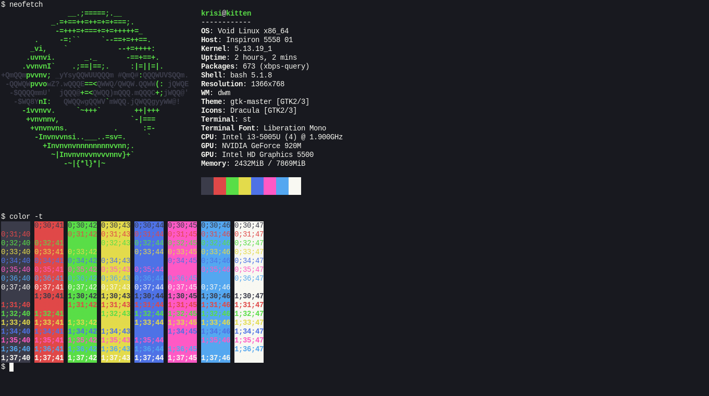

# Vampyric [st](https://st.suckless.org/)

> A dark theme for [st](https://st.suckless.org/).



## Install

1. Download the `st.vd.diff` patch.
2. Apply the patch as follows to install the theme:

```sh
$ mv st-vd.diff st/
$ cd st/
$ patch -p1 < st-vd.diff
$ sudo make clean install
```

## Team

This theme maintained by:

[](https://github.com/RaphGL) |
--- |
[Uiyx](https://github.com/Uiyx) |

## License

Distributed under MIT License. See `LICENSE` for more information.
